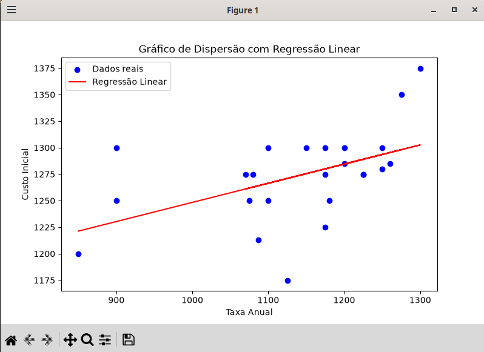

# Análise de Regressão Linear - Custo Inicial vs Taxa Anual

## Descrição do Projeto

Este projeto consiste em um script em Python que realiza uma análise de regressão linear simples entre duas variáveis: Taxa Anual (FrqAnual) e Custo Inicial (CusInic). O script carrega os dados de um arquivo CSV, remove outliers utilizando o método do Intervalo Interquartil (IQR), ajusta um modelo de regressão linear, gera um gráfico de dispersão com a reta de regressão e realiza uma previsão para um novo valor informado pelo usuário.

## Estrutura dos Arquivos

- main.py: Script principal contendo toda a lógica de processamento, modelagem e visualização.
- slr12.csv: Arquivo de dados contendo as colunas FrqAnual (Taxa Anual) e CusInic (Custo Inicial).

## Funcionalidades

- Carregamento dos dados a partir de um arquivo CSV separado por ponto e vírgula.
- Exibição do formato original dos dados.
- Cálculo dos quartis (Q1 e Q3) e do intervalo interquartil (IQR).
- Definição dos limites inferior e superior para identificação de outliers.
- Remoção de outliers com base nos limites calculados.
- Exibição do formato dos dados após a remoção de outliers.
- Ajuste de um modelo de regressão linear utilizando a biblioteca scikit-learn.
- Geração de um gráfico de dispersão com a reta de regressão.
- Previsão do custo inicial para uma nova taxa anual fornecida pelo usuário.

## Como Executar

1. Certifique-se de ter as bibliotecas necessárias instaladas:
   ```
   pip install pandas matplotlib scikit-learn
   ```

2. Coloque o arquivo slr12.csv no mesmo diretório do script main.py.

3. Execute o script:
   ```
   python main.py
   ```

4. Após a execução, o gráfico será exibido e o programa solicitará a entrada de uma nova taxa anual para realizar a previsão.

## Gráfico Gerado

O gráfico de dispersão gerado pelo script apresenta os dados reais em azul e a reta de regressão linear em vermelho. Abaixo está o espaço reservado para a imagem do gráfico:



Substitua "caminho_para_imagem.png" pelo caminho real da imagem gerada, se desejar armazená-la.

## Exemplo de Saída

```
Formato original dos dados: (36, 2)

Limite Inferior:
FrqAnual    921.875
CusInic    1137.500
Name: 0.25, dtype: float64
Limite Superior:
FrqAnual    1337.500
CusInic    1575.000
Name: 0.75, dtype: float64

Formato após a remoção de outliers: (32, 2)

Taxa Anual da Franquia: 1200
Previsão de Custo Inicial R$: 1312.50
```

## Observações

- O script remove automaticamente outliers com base no critério IQR, o que pode alterar o conjunto de dados original.
- A previsão é feita utilizando o modelo treinado com os dados após a remoção de outliers.
- O gráfico é exibido interativamente e não é salvo automaticamente em disco.

## Autor

Desenvolvido como parte de um exercício acadêmico de análise de dados e regressão linear.